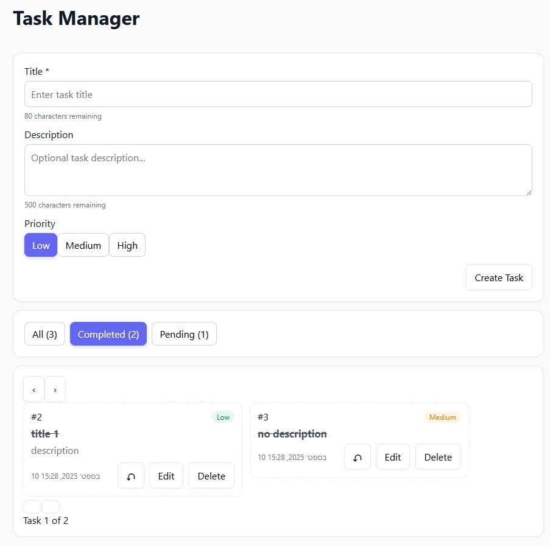
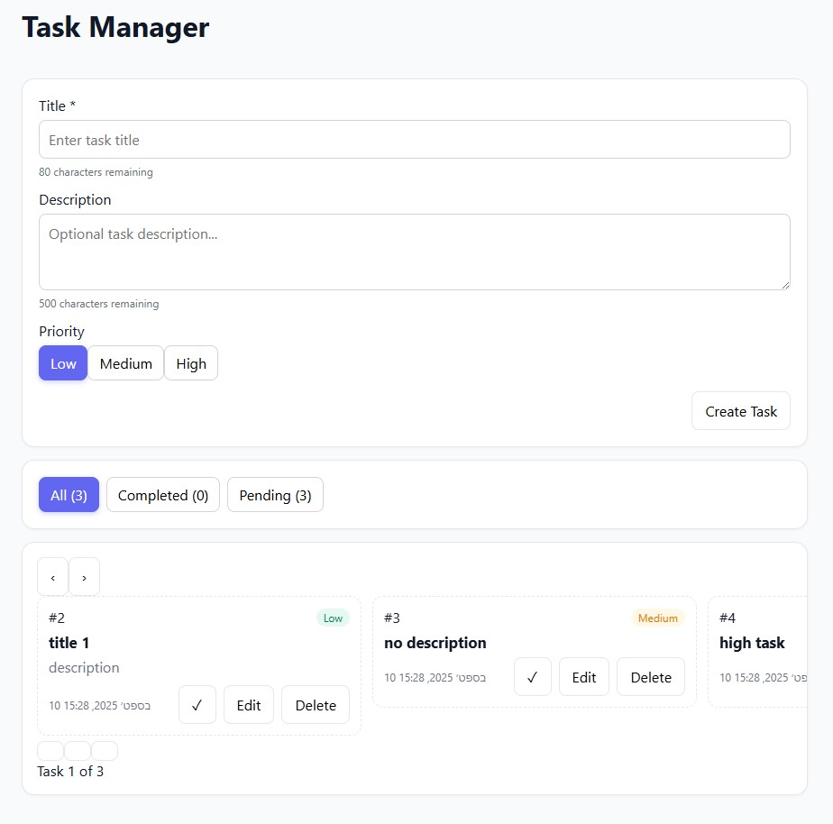
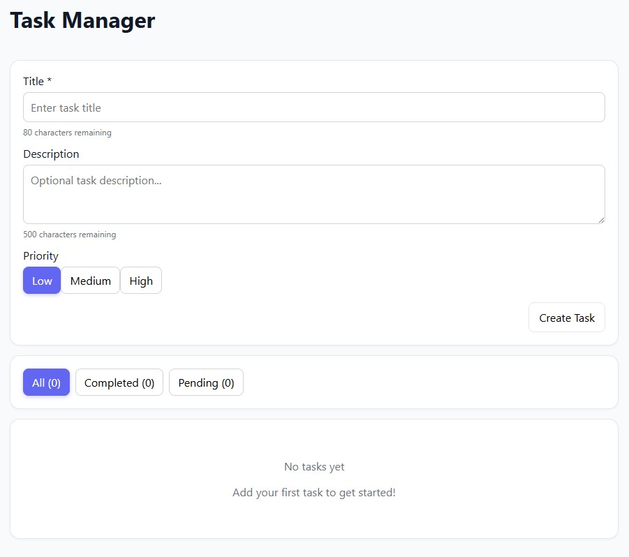

# Task Manager Application

A modern, full-stack task management application built with React, Node.js and Express.js, featuring a light theme UI with carousel-based task navigation.

## Quick Start

git clone <repository-url>
cd Yarden_Greenpeter_helfy_task/backend
npm install
npm run assigenment:start

Access at: http://localhost:4000


## Project Structure

```
task-manager/
├── backend/                  # Express.js backend server
│   ├── dist/                  # Built frontend files (auto-generated)
│   ├── middleware/            # Custom middleware
│   │   └── middleware.js        # Request logging, Unknown Endpoint
│   ├── models/                # Data model
│   │   └── task.js              # Task model with in-memory storage
│   ├── routes/                # API route definitions
│   │   └── task.js              # Task CRUD operations
│   ├── app.js                 # Express app configuration
│   ├── index.js               # Server entry point
│   └── package.json           # Backend dependencies and scripts
│
├── frontend/                 # React.js frontend application
│   ├── src/
│   │   ├── components/        # React components
│   │   │   ├── TaskForm.jsx     # Task creation/editing form
│   │   │   ├── TaskFilter.jsx   # Task filtering controls
│   │   │   ├── TaskItem.jsx     # Individual task card
│   │   │   └── TaskList.jsx     # Carousel-based task display
│   │   ├── services/          # API service layer
│   │   │   └── api.js           # HTTP client for backend API
│   │   ├── styles/            # CSS styling
│   │   │   └── app.css          # Modern light theme styles
│   │   ├── App.jsx            # Main application component
│   │   └── main.jsx           # React app entry point
│   ├── index.html             # HTML template
│   ├── package.json           # Frontend dependencies
│   └── vite.config.js         # Vite build configuration
│
└── README.md                  # Project documentation
```

### Available Scripts

Backend:

npm run assigenment:start - Install deps & start server
npm run build:ui - Build frontend
npm start - Production server
npm run dev - Development mode

Frontend:

npm run dev - Dev server (port 5173)
npm run build - Build for production

## API Documentation

Base URL: `http://localhost:4000/api/tasks`

### Endpoints
##Get All Tasks##
  GET /api/tasks
  Response:
  200 - Array of task objects
  500 - Internal server error

##Get Single Task##
  GET /api/tasks/:id
  Response:

    200 - Task object
    404 - Task not found
    500 - Internal server error

Create Task
POST /api/tasks
Content-Type: application/json
Request Body:
json{
  "title": "Task title",
  "description": "Optional description",
  "priority": "low|medium|high",
  "completed": false
}
Response:

201 - Created task object
400 - Validation error or missing request body
500 - Internal server error

Update Task
PUT /api/tasks/:id
Content-Type: application/json
Request Body:
json{
  "title": "Updated title",
  "description": "Updated description",
  "priority": "high",
  "completed": true
}
Response:

200 - Updated task object
400 - Validation error or missing request body
404 - Task not found
500 - Internal server error

Toggle Task Completion
PATCH /api/tasks/:id/toggle
Response:

200 - Updated task object with toggled completion status
404 - Task not found
500 - Internal server error

Delete Task
DELETE /api/tasks/:id
Response:

204 - No Content (successful deletion)
404 - Task not found
500 - Internal server error


### Task Object Schema

```javascript
{
  "id": 1,                           // Auto-generated unique ID
  "title": "Task title",             // Required, max 80 characters
  "description": "Task description", // Optional, max 500 characters
  "priority": "low",                 // "low", "medium", or "high"
  "completed": false,                // Boolean completion status
  "createdAt": "2024-01-01T12:00:00.000Z" // ISO timestamp
}
```

### Error Responses

```javascript
// Validation Error (400)
{
  "error": "Title is required and must be a string",
  "code": "VALIDATION_ERROR"
}

// Missing Request Body (400)
{
  "error": "Request body is required",
  "code": "MISSING_BODY"
}

// Task Not Found (404)
{
  "error": "Task with ID 123 not found",
  "code": "TASK_NOT_FOUND"
}

// Internal Server Error (500)
{
  "error": "Internal server error",
  "code": "INTERNAL_ERROR"
}
```

## Design Decisions

Used the attached pdf to formulate the main components of the app, add validation on front and backend, 
decided to add  more files to make a better and seperated logic handling.
added scripts for easier running and setup


## Features

Create, edit, delete tasks
Mark tasks complete/incomplete
Filter by status (all/completed/pending)
Priority levels with color coding
Carousel navigation for tasks
Responsive design

## Time Breakdown

**Total: 4 hours**

- Backend API & Testing: 90 minutes
- Frontend components & testing: 120 minutes  
- Styling & polish: 20 minutes
- Scripts & readme: 10 minutes

## Screenshots






---

**Author:** Yarden Greenpeter  
**Created:** 2025

**Tech Stack:** React.js, Express.js, Node.js, Vite

